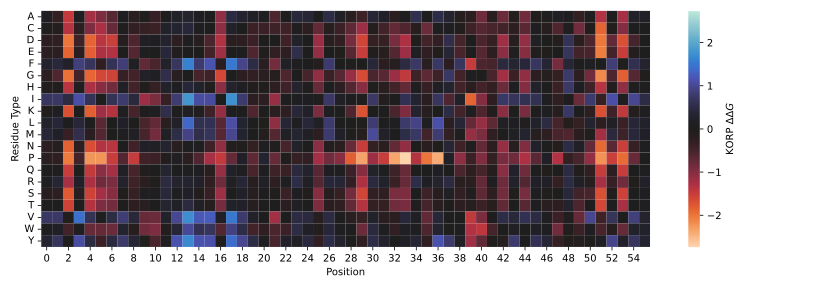

# PyKORP

Python bindings and PyTorch implementation of [KORP](https://github.com/chaconlab/Korp).

## Installation

```bash
pip install pykorp # optional: pip install pykorp[ckorp]

# or 

pip install git+https://github.com/naturegeorge/pykorp
```

## Usage

### KORP Energy Evaluation

```python
import pykorp
from pykorp import frame_coords, featurize_frames, korp_energy
import torch

device = 'cpu' # or 'cuda:0'

try:
    config = pykorp.config('korp6Dv1.bin', device=device)
except Exception:
    config = torch.load('korp6Dv1.bin.pt', map_location=device)

chain_info, n_coords, ca_coords, c_coords = pykorp.pdb_io('2DWV.cif.gz', device=device)
modnum = n_coords.shape[0]
seqab, seqsepab = pykorp.seq_info(chain_info['seq'], chain_info['seq_index'], chain_info['length'])
seqab, seqsepab = seqab.expand(modnum, *seqab.shape[1:]), seqsepab.expand(modnum, *seqsepab.shape[1:])
features = featurize_frames(frame_coords(n_coords, ca_coords, c_coords), ca_coords, mask=seqsepab > 1)

korpe = korp_energy(features, seqab, seqsepab, config)
```

### KORPM ${\Delta\Delta G}$ Calculation

Applying KORP to the prediction of protein stability change under single-point mutations:

```python
import pykorp
from pykorp import frame_coords, featurize_frames, korpm_energy
from pykorp.feat import aa20_one_letter_code
import torch

chain_info, n_coords, ca_coords, c_coords = pykorp.pdb_io('2LHD.cif.gz', device=device)
modnum = n_coords.shape[0]
seqab, seqsepab = pykorp.seq_info(chain_info['seq'], chain_info['seq_index'], chain_info['length'])
seqab, seqsepab = seqab.expand(modnum, *seqab.shape[1:]), seqsepab.expand(modnum, *seqsepab.shape[1:])
features = featurize_frames(frame_coords(n_coords, ca_coords, c_coords), ca_coords, mask=seqsepab > 1)

# Single-Point Deep Mutational Scanning (Best on GPU devices)
ddG = korpm_energy(features, seqab, seqsepab, config, mutations=None)
# NOTE: Passing `mutations=None` would result in DMS.

# You can also input specific mutations like:
mutations = [(24, 'I'), (44, 'L')]
mutations = [(pos, aa20_one_letter_code.index(aa)) for pos, aa in mutations]
ddG = korpm_energy(features, seqab, seqsepab, config, mutations=mutations)
```



## Reference

```bibtex
@article{10.1093/bioinformatics/btz026,
  author   = {López-Blanco, José Ramón and Chacón, Pablo},
  title    = {{KORP: knowledge-based 6D potential for fast protein and loop modeling}},
  journal  = {Bioinformatics},
  volume   = {35},
  number   = {17},
  pages    = {3013-3019},
  year     = {2019},
  month    = {01},
  issn     = {1367-4803},
  doi      = {10.1093/bioinformatics/btz026}
}
@article{10.1093/bioinformatics/btad011,
  author   = {Hernández, Iván Martín and Dehouck, Yves and Bastolla, Ugo and López-Blanco, José Ramón and Chacón, Pablo},
  title    = {{Predicting protein stability changes upon mutation using a simple orientational potential}},
  journal  = {Bioinformatics},
  volume   = {39},
  number   = {1},
  pages    = {btad011},
  year     = {2023},
  month    = {01},
  issn     = {1367-4811},
  doi      = {10.1093/bioinformatics/btad011},
}
```

If you use this software in your work, please also cite:

```bibtex
@software{PyKORP_2025,
  author  = {Zhu, Zefeng},
  license = {MIT},
  title   = {{PyKORP: Python bindings and PyTorch implementation of KORP.}},
  url     = {https://github.com/naturegeorge/pykorp},
  version = {1.0.0},
  year    = {2025},
  month   = {01}
}
```